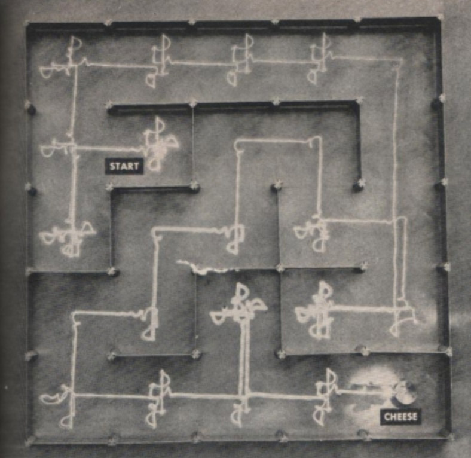
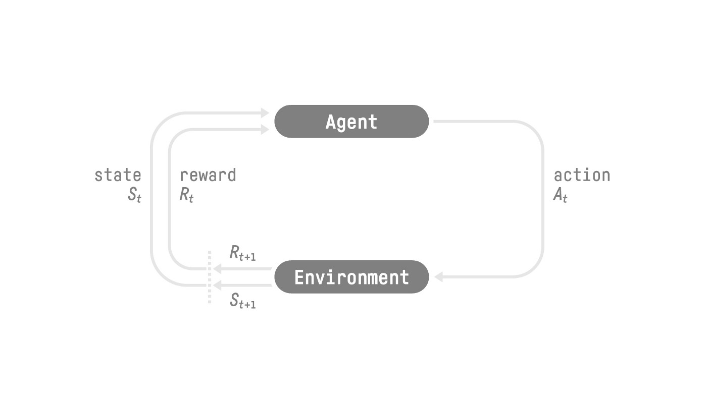
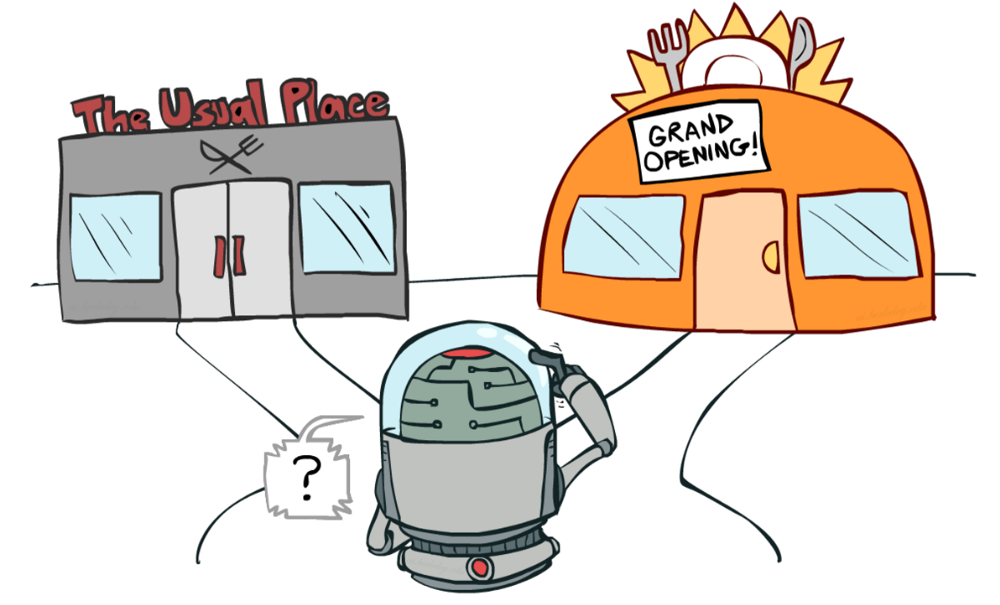

# Reinforcement Learning: Introduction

References:

- [ehennis/ReinforcementLearning](https://github.com/ehennis/ReinforcementLearning): Repository for my CS6460 Education Technology Project
- [Hugging Face - Deep RL Course - Introduction to Deep Reinforcement Learning](https://huggingface.co/learn/deep-rl-course/unit1/rl-framework)

Resources:

- Article [naklecha's site - a reinforcement learning guide](https://naklecha.notion.site/a-reinforcement-learning-guide)
- Textbook [Reinforcement Learning: An Introduction - 2nd](http://www.incompleteideas.net/book/the-book.html)
- MOOC
  - [Coursera: Reinforcement Learning Specialization](https://www.coursera.org/specializations/reinforcement-learning)
  - [HuggingFace: huggingface/deep-rl-class](https://github.com/huggingface/deep-rl-class): This repo contains the Hugging Face Deep Reinforcement Learning Course.
- [OpenAI Spinning Up - Welcome to Spinning Up in Deep RL](https://spinningup.openai.com/en/latest/index.html)

source: [History of Mazes](https://maze.conductscience.com/historical-mazes/)

## Reinforcement Learning Basics

- Decision Making
- Markov Decision Process (MDP)
  - Probability Model -> Probabilty Graph Model (PGM)
- Value Iteration
- Policy Iteration
- Deterministic and Stochastic Movements

## 理解强化学习的核心概念

- Agent (智能体)
- Environment (环境)
- Reward (奖励)
- More
  - state (状态)
  - observations (观测)
    - full observability
    - partial observability
  - action spaces (动作空间)
  - policy (策略) => next action 下一步的动作
  - value functions (值函数) => 基于奖励 (reward) 构造

source: wikipedia

source: [HuggingFace Deep RL Course](https://huggingface.co/learn/deep-rl-course/unit1/rl-framework)

## Modeling

- $\cal{S}$ or $S$
  - A set of environment and agent states (环境状态的集合)
  - $\cal S = \{ s_1, s_2, s_3, ..., s_i \}$
- $\cal A$ or $A$
  - A set of actions (the action space) (动作的集合)
  - $\cal A = \{ a_1, a_2, ..., a_i \}$
- $P_a(s, s') = \Pr (S_{t+1} = s' | S_t = s, A_t = a)$
  - the transition probability (at time $t$) from state $s$ to state $s'$ under action $a$.
  - 在状态之间转换的规则（转移概率矩阵）
- $R_a(s, s')$
  - the immediate reward after transition from $s$ to $s'$ under action $a$.
  - 规定转换后“即时奖励”的规则（奖励函数）

source: [HuggingFace Deep RL Course](https://huggingface.co/learn/deep-rl-course/unit1/rl-framework)

> From Wikipedia (tunned):
>
> The agent's **action selection** is modeled as a map called policy
>
> $$
> \begin{array}{c}
> \pi : \cal S \times \cal A \to [0, 1] \\
> \pi (s, a) = \Pr (_t = a | S_t > = s)
> \end{array}
> $$
>
> The policy map gives the probability of taking action $a$ when in state $s$.
>
> The goal of a reinforcement learning agent is to learn a policy
> that maximizes the expected cumulative reward.

强化学习的主体与环境基于离散的时间步作用。在每一个时间 $t$，主体接收到一个观测 $o_t$，通常其中包含奖励 $r_t$。然后，它从允许的集合中选择一个动作 $a_t$，然后送出到环境中去。环境则变化到一个新的状态 $s_t$，然后决定了和这个变化 $s_t, a_t , s_{t+1}$ 相关联的奖励 $r_{t + 1}$。

source: [HuggingFace Deep RL Course](https://huggingface.co/learn/deep-rl-course/unit1/rl-framework)

## The points

### Exploration–exploitation Trade off

What is [Exploration–exploitation dilemma](https://en.wikipedia.org/wiki/Exploration%E2%80%93exploitation_dilemma): 两种对立策略之间的平衡行为。

- exploitation (of current knowledge)
  - 利用、执行
  - 利用是指根据当前对系统的了解（可能是不完整的或误导性的）选择最佳选项
- exploration (of uncharted territory)
  - 探索、勘探
  - 探索则是指尝试新的选项，这些选项可能会在未来带来更好的结果，但会牺牲利用机会。
- more readings: [Article: Exploration Strategies in Deep Reinforcement Learning](https://lilianweng.github.io/posts/2020-06-07-exploration-drl/)

source: [HuggingFace Deep RL Course](https://huggingface.co/learn/deep-rl-course/unit1/exp-exp-tradeoff)

### "Policy" in learning

Agent Policy ($\pi$) -> What's the next action and state $\cal S \times \cal A$

Learning policy

- behavior policy (State value function)
  - policy to sample state and reward
  - 采样数据的策略为行为策略 (behavior policy)
    - 先采样 (=> 预测)，再行动
    - 先行动，再采样 (=> 观测)
- target policy (Action value function)
  - action selection
  - 称用这些数据来更新的策略为目标策略 (target policy)
    - eg.: exploitation / exploration

Two types of learning policy

- off-policy (异策略)
  - example: Q-learning
  - 下一个状态 $(s_{t+1}, a_{t+1})$ 依赖于 $(s_t, a_t, r_t, s_{t+1})$
  - 先更新后根据 (评估) 策略选择动作
    - 选择动作就是一个行动策略
  - 行动策略 (what's the next action?) 和评估策略 (what would reward after next action) 不同
- on-policy (同策略) -> optimal policy (近似最优)
  - example: SARASA (State–action–reward–state–action)
  - 下一个状态 $(s_{t+1}, a_{t+1})$ 依赖于 $(s_t, a_t, r_t, s_{t+1}, a_{t+1})$ (五元组)
  - 先做出动作后更新策略
  - 当前优化的策略的样本是来自于这个策略 <=> 只使用了当前策略产生的样本
  - 在一个迭代里行动策略和评估策略相同

### Main approaches

- Model free
  - 人话: 模型自由的强化学习不依赖于环境的内部模型 (依赖外界的 feedback / Reward)
  - 数语: 不需要知道状态之间的转移概率 (transition probability)
- Model based
  - 人话: 模型基础的强化学习则是依赖于环境的一个内部模型来做决策。它先尝试理解环境，然后基于这个理解来计划最优行动。
  - 数语: 知道状态之间的转移概率
  - 继续细分
    - Policy Iteration: 选定策略 -> 更新策略
    - Value Iteration: 选定值 -> 更新值

> If you want a way to check if an RL algorithm is model-based or model-free, ask yourself this question: after learning, can the agent make predictions about what the next state and reward will be before it takes each action?
>
> -- from _Quora_

### Why reinforcement learning?

强化学习的强大能力来源于两个方面

1. 使用样本 (aka: 观测) 来优化 (aka: 学习) 行为
2. 使用函数**近似**来描述复杂的环境。
   - 物理人看到近似应该会很敏感吧 LoL

它们使得强化学习可以使用在以下的复杂环境中：

- 模型的环境已知，且解析解不存在
- 仅仅给出环境的模拟模型（模拟优化方法的问题
- 从环境中获取信息的唯一办法是和它互动。前两个问题可以被考虑为规划问题，而最后一个问题可以被认为是 genuine learning 问题。使用强化学习的方法，这两种规划问题都可以被转化为机器学习问题。

### Comparison of key algorithms

- [Wikipedia: Comparison of key algorithms](https://en.wikipedia.org/wiki/Reinforcement_learning)

## Case Study

### 迷宫导航

Q-learning 通过时序差分更新实现价值函数的渐进收敛。

## Classical CS Algorithms

- 动态规划
- Brute force (枚举) -> 回溯 + 剪枝

## Physics x AI

### Concepts

- 状态空间（State Space）的物理对应（如粒子坐标）
- 概率模型
  - 马尔可夫过程
  - 统计力学
- 奖励函数设计原则
  - 物理系统约束
  - 最小能量原则
  - 各种守恒量

### Applications

- 量子系统控制案例
- 粒子加速器参数优化
- 超材料结构设计

- [Universal quantum control through deep reinforcement learning](https://www.nature.com/articles/s41534-019-0141-3)
