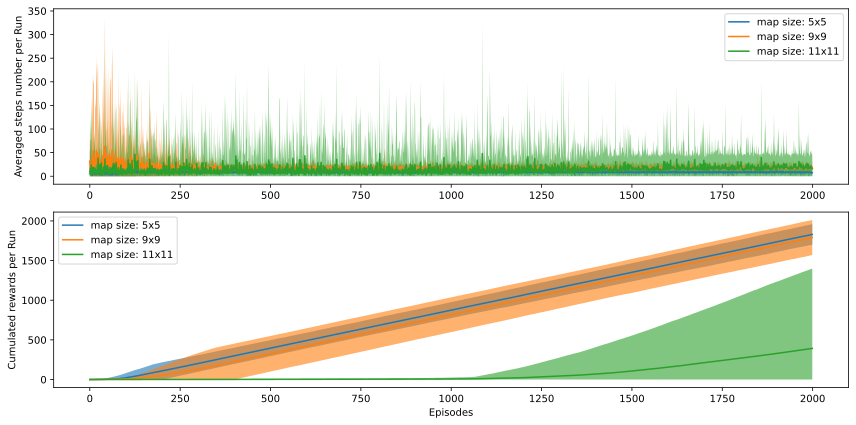

# Homework 1

Write a simple markdown as report, then submit your report (using your nickname as filename, e.g.: `lqhuang.md`) to `courses/2025/submissions` (assets could be saved to `courses/2025/submissions/assets`) via GitHub Pull Request.

Hints for how to summit:

- Fork `smolrl-tutorials` repo into your personal space
- Clone your own `smolrl-tutorials` to local environment
- Checkout the `main` branch into a new `whatever-name` branch
- Do your work on the `whatever-name` branch
- Commit and push the results to yourself repo
- Write a pull request to let me merge your changes into `yhma-lab/smolrl-tutorials`.

The report should answer the following questions

1. 仔细阅读整个代码库, 找出目前已有的实现里面, 如何体现 Q learning 的 update formula。把 update formula 拆解成不同的部分, 把源代码中相应的部分粘贴过来。

2. 运行

   - `python run_forzen_lake.py --play-mode human --render-mode human`
   - `python run_forzen_lake.py --play-mode agent --render-mode rgb_array --vis`

   展示自己的 Frozen Lake 的游戏画面和每个 episode 过程中 steps to goal 和 cumulated rewards 的变化曲线. 思考怎么判断收敛了吗?

3. 运行 `python run_forzen_lake.py --play-mode agent --render-mode rgb_array`, 展示完成一个完整实验后, 得到的统计分析和学习到的 Q Table 和每个状态下的 best action heatmap.

4. 比较不同 map size 下 (5, 7, 9, 13), learning converge 的变化情况, Optional: 可以尝试改变一下 `proba_frozen` / `epsilon` / `is_slippery` 等其他参数观察一下区别

