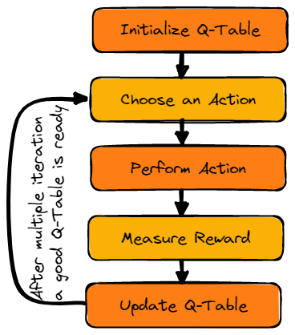
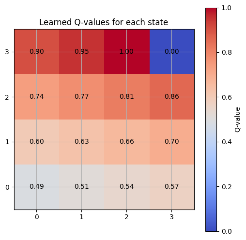
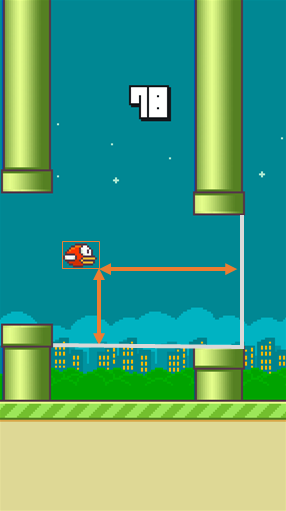
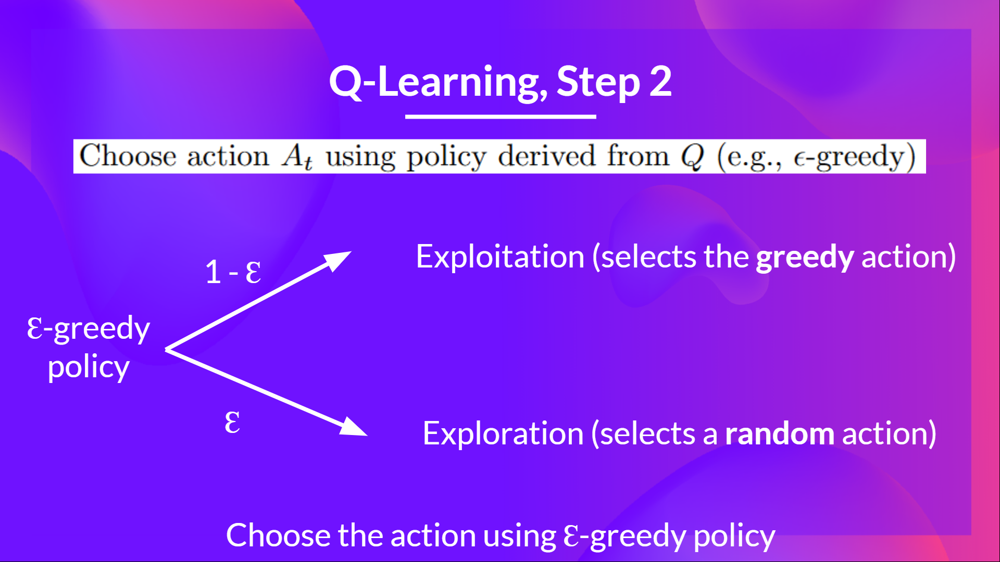
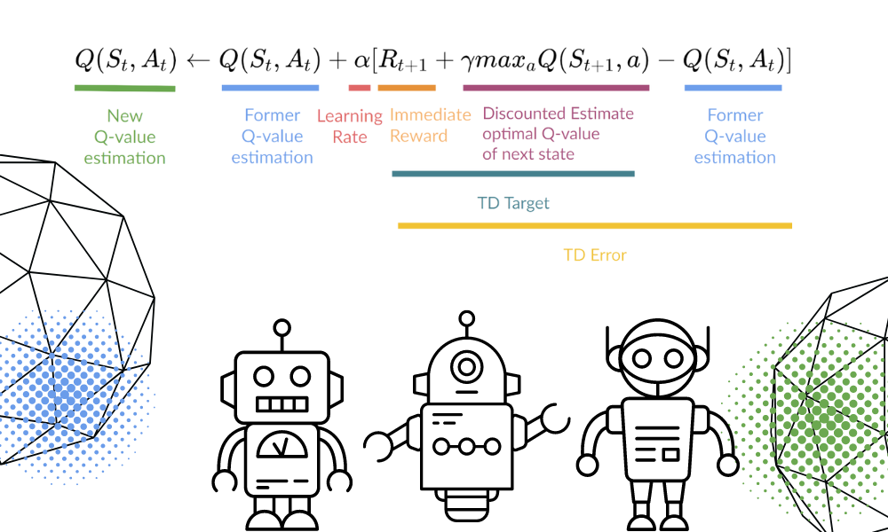

# Reinforcement Learning: Q learning

References:

- [rezaborhani's blog: Q-Learning](https://rezaborhani.github.io/mlr/blog_posts/Reinforcement_Learning/Q_learning.html)
- [Wikipedia: Q-learning](https://en.wikipedia.org/wiki/Q-learning)
- [Mathematical Foundations of Reinforcement Learning](https://github.com/MathFoundationRL/Book-Mathematical-Foundation-of-Reinforcement-Learning)
  - [Lu, Yukuan: Q Learning](https://lyk-love.cn/2024/06/22/q-learning/)
- [Hugging Face - Deep RL Course - Unit 2: Introduction to Q-Learning](https://huggingface.co/learn/deep-rl-course/unit2/introduction): We’re on a journey to advance and democratize artificial intelligence through open source and open science.

## Q Learning Basics

Ref:

- Christopher Watkins and Peter Dayan, Q-learning, Machine learning, 8.3-4, 1992, 279-292. [pdf](https://www.gatsby.ucl.ac.uk/~dayan/papers/cjch.pdf), [errata](https://www.gatsby.ucl.ac.uk/~dayan/papers/cjcherr.pdf)

> Q-Learning is an off-policy value-based method that uses a TD approach to train its action-value function.
> Q-Learning is the algorithm we use to train our Q-function, an action-value function that determines the value of being at a particular state and taking a specific action at that state.
>
> source: [HuggingFace Deep RL Course](https://huggingface.co/learn/deep-rl-course/unit2/q-learning)

Serveral descriptions / properties for Q Learning

- Value based method
  - what's more, Q function is a action value function (instead of state value function)
- Off policy
  - Q learning uses Temporal Difference Learning (TD Learning)

## Algorithm

<!-- 目标: 从策略 $\pi'$ 生成历史样本，并从中学习到一个最优 (optimal) 的策略 $\pi$ -->

1. 初始化:
   - Q 值 $Q(s, a)$ 即关于状态-动作对 (state-action pairs) 的函数
     - 根据实现和场景，可以使用随机值、特定分布甚至全部置零
   - 策略 (policy) $\pi(a | s)$
2. 进行迭代算法 (For life or until learning is stopped)
   1. 收集对世界环境的观测 $s_t$
   2. 根据当前 Q 值估计 (Q-value estimates) $Q_t(s, \cdot)$ 和 $\pi_t(a | s)$ 在当前世界状态 $s_t$ 中选择一个动作 $a_t$
   3. 执行动作 ($a_t$) 并观察结果状态 ($s_{t+1}$) 和奖励 ($r_{t+1}$)。
   4. 对真实 Q 值进行更新 $Q_{t+1} (s_t, a_t) := Q_t(s_t, a_t) + \alpha [r_{t+1} + \gamma\max_{\substack a'} Q(s_{t+1}, a_{t+1}) - Q_t(Q_{t+1}, a_t)]$

source: [DataCamp - An Introduction to Q-Learning: A Tutorial For Beginners](https://www.datacamp.com/tutorial/introduction-q-learning-beginner-tutorial)

## Representation of Q funcion and state-action pair

### Discrete state Space

> Q 值 $Q(s, a)$ 即关于状态-动作对 (state-action pairs) 的函数
>
> Q Table <-> Pair of (State space, Action) $(s_i, a_j)$

| State (i, j) | State (live/hold/goal)          | Left | Right | Up  | Down |
| ------------ | ------------------------------- | :--: | :---: | :-: | :--: |
| (0, 0)       |           |  0   |   0   |  0  |  0   |
| (0, 1)       |           |  0   |   0   |  0  |  0   |
| (1, 0)       |           |  0   |   0   |  0  |  0   |
| ....         | ...                             | ...  |  ...  | ... | ...  |
| (1, 1)       |  |  0   |   0   |  0  |  0   |
| ....         | ...                             | ...  |  ...  | ... | ...  |
| (2, 3)       |  |  0   |   0   |  0  |  0   |
| (3, 3)       |          |  0   |   0   |  0  |  0   |

$Q(\mathrm{state}=(0,1), \mathrm{action}=Right)$ = 0

After training or learning

| State (i, j) | State (live/hold/goal)          | Left | Right  | Up  | Down |
| ------------ | ------------------------------- | :--: | :----: | :-: | :--: |
| (0, 0)       |           |  0   |   0    |  0  | 0.1  |
| (0, 1)       |           |  0   | -10.12 |  0  |  0   |
| (1, 0)       |           |  0   |   0    |  0  |  0   |
| (1, 1)       |  |  0   |   0    |  0  |  0   |
| ....         | ...                             | ...  |  ...   | ... | ...  |
| (3, 2)       |  |  0   |  1.1   |  0  |  0   |
| (3, 3)       |          |  0   |   0    |  0  |  0   |

- $Q(\mathrm{state}=(0,1), \mathrm{action}=Right)$ = -10.12
- $Q(\mathrm{state}=(3,2), \mathrm{action}=Right)$ = 1.1

Then we could plot a heatmap for $\max_a Q(s, a)$, the real Q Table is shaped as (M, N, 4).

source: [Q-Learning in Reinforcement Learning](https://www.geeksforgeeks.org/q-learning-in-python/)

### Continuous state Space

source: [Flappy Bird RL](http://sarvagyavaish.github.io/FlappyBirdRL/)

| State        | Up  | NOOP |
| ------------ | :-: | :--: |
| $(x_1, y_1)$ |  0  |  0   |
| $(x_2, y_2)$ |  0  |  0   |
| $(x_3, y_3)$ |  0  |  0   |
| ...          | ... | ...  |
| $(x_m, y_m)$ |  0  |  0   |
| ...          | ... | ...  |

after training or learning

| State        | State    |  Up   |  NOOP  |
| ------------ | -------- | :---: | :----: |
| $(x_1, y_1)$ | ~~live~~ | 0.247 |   ?    |
| $(x_2, y_2)$ | ~~live~~ |   ?   | -1.000 |
| $(x_3, y_3)$ | ~~dead~~ |   ?   |   ?    |
| ...          |          |  ...  |  ...   |
| $(x_m, y_m)$ | ~~live~~ |   ?   |   ?    |
| ...          |          |  ...  |  ...   |

## Iteration process

### Start from Bellman equation (贝尔曼方程)

The Bellman equation (also known as Dynamic Programming Equation) is a fundamental concept in dynamic programming and reinforcement learning. Essentially, the Bellman equation breaks down the decision-making problem into smaller, manageable subproblems and then combines their solutions to determine the optimal policy.

> 贝尔曼方程将“决策问题在特定时间点的值”以“来自初始选择的报酬及由初始选择衍生的决策问题的值”的形式表示。藉这个方式将动态最佳化问题变成较简单的子问题，而这些子问题遵守由贝尔曼所提出的“最佳化原理”。

贝尔曼方程把一个问题转化成了可以递归解决的形式，通俗点理解成为变成了迭代问题。

马尔可夫链下的贝尔曼方程，描述当前状态到未来状态的一个转移

$$
\begin{align}
V_{\pi}(s)
&= \mathbb{E}\left[R_t(s,a) + \gamma \cdot V_\pi(S_{t+1}|S_t=s)\right] \\
&= ... \\
&= R(s,a) + \gamma \sum_{s_{t+1}} P(s_{t+1}|s, a) V(s_{t+1})
\end{align}
$$

Read more:

- [Bellman equation - Wikipedia](https://en.wikipedia.org/wiki/Bellman_equation)
- [Understanding the Bellman Equation in Reinforcement Learning | DataCamp](https://www.datacamp.com/tutorial/bellman-equation-reinforcement-learning)
- [Markov Decision Processes (MDP) and Bellman Equations - Deep Learning Wizard](https://www.deeplearningwizard.com/deep_learning/deep_reinforcement_learning_pytorch/bellman_mdp)

Thinking questions:

What's the difference between

- Bellman Equation
- Bellman Optimality Equation
- Bellman Expectation Equations

### Update Q and learn policy

Q value function is a full expanded **Bellman Optimality Equation** (BOE) to find the maximum expected value for each action, helping agents identify the best moves to maximize their long-term rewards.

$$
\begin{align}
Q_{t+1}(s_t, a_t)
&\gets Q_t(s_t, a_t) + \alpha \big( r_{t+1} + \gamma \cdot \max_{a \in \mathcal A_{s_{t+1}}} Q_t( s_{t+1} , a) - Q_t (s_{t+1}, a_t) \big) \\
&= (1 - \alpha)Q(s_t, a_t) + \alpha (r_{t+1} + \gamma \max_{a \in \mathcal A_{s_{t+1}}} Q_t( s_{t+1} , a))

\end{align}
$$

核心概念

- Action Value function $Q(s, a)$ (价值函数)
  - 当前状态 $s$ 下执行行动 $a$ 的 $Q$ 值。
- $s'$ <-> $s_{t+1}$
  - next state, **predicated**
  - 是执行行动 $a$ 后的新状态。
- Learning rate $\alpha$ (学习率)
  - A factor determining how much new information overrides old information.
  - A higher learning rate means the agent learns faster, updating its Q-values more significantly with new rewards and experiences.
  - 学习率，决定了**新获得**的信息对现有 Q 值的影响程度。
- Discounting rate $\gamma$ (衰减因子)
  - This factor discounts the value of future rewards compared to immediate rewards.
  - 折扣因子，用于平衡即时奖励和未来奖励的重要性。
  - A higher discount factor means that future rewards are more valuable, encouraging long-term beneficial actions over short-term gains.
  - $\gamma$ 越大，Agent 就会越重视以往经验 ($\max_{a'}Q(s', a)$) ，$\gamma$ 越小， Agent 越重视眼前利益 ($R)。
- $R_{t+1}$ <-> $R(s_t \to s_{t+1}, a_t)$
  - 是执行行动 $a_t$ 后，从 $s_t$ 转换到 $s_{t+1}$ 所获得的即时奖励。
- Epsilon-Greedy Strategy $\varepsilon$ (贪婪策略因子)

$Q_{t+1}(s_t, a_t)$ is the sum of three parts:

1. $(1 - \alpha)Q(s_t, a_t)$: the current value (weighted by one minus the learning rate)
2. $\alpha r_{t+1}$: The reward $r_{t+1}$ to obtain if action $a_t$ is taken when in State $s_t$ (weighted by learning rate)
3. $\max_{a \in \mathcal A_{s_{t+1}}} Q_t( s_{t+1} , a)$: the maximum reward that can be obtained from state $s_{t+1}$ (weighted by learning rate and discount factor)

What we learn actually?

**Policy $\pi$**

- The policy determines what action to take in each state and can be derived from the Q-values.
- Typically, **the policy chooses the action with the highest Q-value in each state (exploitation)**, though sometimes a less optimal action is chosen for exploration purposes.

### $\varepsilon$-greedy 策略的工作原理

$$
\max_{a \in \mathcal A_{s_{t+1}}} Q_t( s_{t+1} , a)
$$

source: [HuggingFace Deep RL Course](https://huggingface.co/learn/deep-rl-course/unit2/q-learning)

### Image illustration

source: [DataCamp - An Introduction to Q-Learning: A Tutorial For Beginners](https://www.datacamp.com/tutorial/introduction-q-learning-beginner-tutorial): Author Thomas Simonini

source: [Q-learning - Wikipedia](https://en.wikipedia.org/wiki/Q-learning)

## Review Q Learning

- Value based method
  - learn a value function that maps a state to the expected value of being at that state.
  - $Q_\pi(s) = \mathbb{E}_{\pi}[R | S_t=s]$
  - 一个状态的值 ($Q$) 是 agent 从该状态开始并按照我们的策略 ($\pi$) 行动时 ($a$) 所能获得的预期贴现收益 ($\mathbb{E}_\pi(R)$)。
  - Q function is a action-value function
    - containing all state-action pair values
  - Policy is dervied from Q function (Value function)
    - Given a state and action, our Q-function (will search its Q-table) give the corresponding Q value.
    - And if we have an optimal Q-function, we have an optimal policy, since we know, for each state, the best action to take.
    - $\pi'(s) = \argmax_a Q'(s, a)$
- Off-policy
  - In Q learning, the updated policy is different from the behavior (action) policy, and that is why it is called the off-policy algorithm.
  - But, actually there is also a on-policy version Q learning

## Case: Frozen Lake

What we cares?

- Step to reach the goal
- Pr(state, action) <-> Q Table

## Case: Flappy Bird

- How many scores we could get?
- State is not discrete anymore, how we get Q function?
